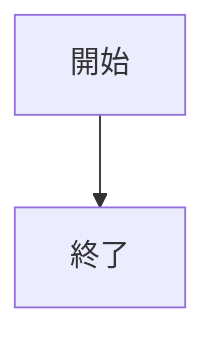
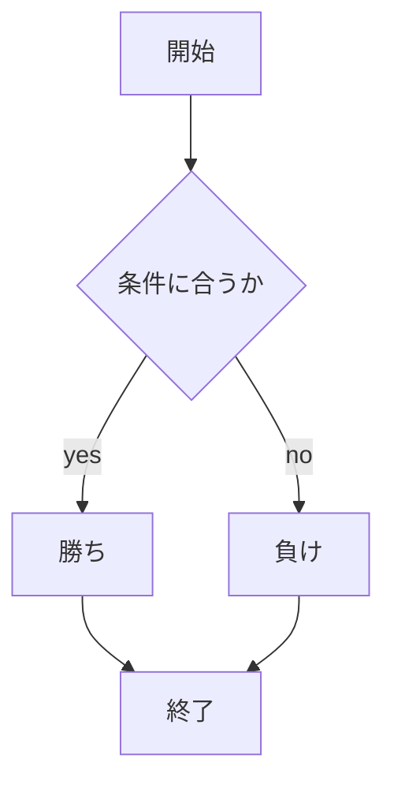

# webpro_06
# app5.js全体のドキュメント
##　起動方法
Node.js と npm がインストールされていることを確認して, app5.js ファイルがあるディレクトリでnode app5.jsを実行してサーバーを起動させる.その後, ブラウザで http://localhost:8080/public/~.html にアクセスすることで、アプリケーションの機能を利用できる.
## Gitによるファイル管理
git add .
git commit -am'変更しました'
git push  
トークン名
これらを順に実行していく.
## ファイル一覧
ファイル名|説明|
-|-
app5.js|プログラム本体|
public/hello.ejs | 挨拶メッセージの開始画面 |
views/hello.html | 挨拶メッセージのテンプレートファイル
public/Apple_logo_black.svg | アイコン画像表示の開始画面
views/icon.ejs | アイコン画像表示のテンプレートファイル |
pubkic/luck.ejs | 運勢占いの開始画面 |
views/luck.html | 運勢占いのテンプレートファイル|
public/janken.html | じゃんけんの開始画面|
views/janken.ejs | じゃんけんのテンプレートファイル|
public/agecheck.html | 年齢チェックの開始画面 |
views/agecheck.ejs|年齢チェックのテンプレートファイル |
public/checkNumber.html | 奇数・偶数判定の開始画面 |
views/checkNumber.ejs | 奇数・偶数判定のテンプレートファイル|

## 機能ごとの説明と使用手順
### 挨拶メッセージ
サーバーを起動し, 「http://localhost:8080/public/hello.html」　にアクセスすることでユーザーに "Hello world"と"Bon jour"を表示する.

### アイコン画面表示
サーバーを起動し, 「http://localhost:8080/public/Apple_logo_black.svg」　にアクセスすることでユーザーに Appleロゴのアイコン画像が表示される.

### 運勢占い
サーバーを起動し, 「http://localhost:8080/public/luck.html」　にアクセスして「運勢を占う」を押すことで運勢が表示される.

### じゃんけん
サーバーを起動し, 「http://localhost:8080/public/janken.html」　にアクセスしてグー, チョキ, パーのいずれかを選択することで勝敗が表示される.

### 年齢チェック
サーバーを起動し, 「http://localhost:8080/public/agecheck.html」　にアクセスして年齢を入力することで, その年齢に応じたメッセージが表示される.

###　奇数・偶数判定
サーバーを起動し, 「http://localhost:8080/public/checkNumber.html」　にアクセスして数値を入力することで, その数値が奇数なのか偶数なのかが表示される.


```javascript
console.log( 'Hello' );
```



